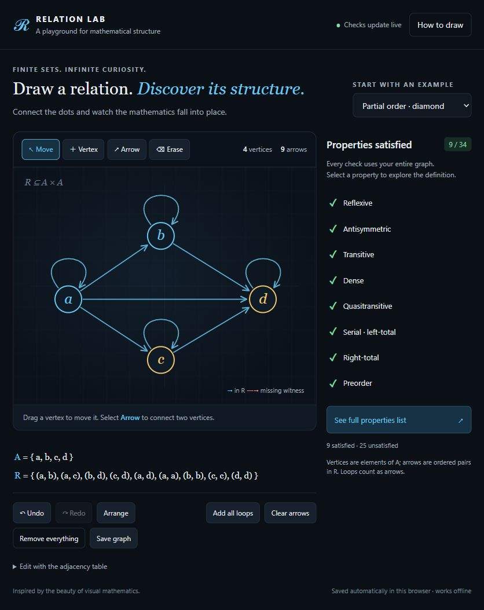

# Relation Lab

An interactive graph maker for exploring homogeneous binary relations. Draw a directed graph and see which mathematical properties it satisfies, with a dark visual style inspired by 3Blue1Brown.



## Run

Open `index.html` in a browser. No installation, build step, external libraries, or internet connection is needed.

## Draw and explore

- **Vertex:** click empty space to add an element, up to 16 vertices.
- **Arrow:** select a source, then a target. Select the same vertex twice to toggle its loop.
- **Move:** drag a vertex to reposition it.
- **Erase:** select a vertex or arrow to remove it.
- Use the adjacency table for keyboard editing.
- Undo and redo edits, arrange vertices, or try the example graphs.
- The right panel lists satisfied properties with green ticks.
- **See full properties list** opens a sidebar with all results, explanations, logical and set-theoretic notation, and graph counterexamples.
- Graphs are saved automatically in the current browser. **Save graph** exports an SVG image.

## Properties checked

The app runs 34 checks:

- Reflexive, irreflexive, coreflexive, symmetric, antisymmetric, asymmetric.
- Transitive, antitransitive, dense, cotransitive, negatively transitive, quasitransitive, transitive incomparability, right Euclidean, left Euclidean, acyclic.
- Connex on distinct elements, strongly connex, trichotomous, trichotomy modulo incomparability.
- Serial, right-total, right-unique, left-unique.
- Equivalence relation, preorder, partial order, strict partial order, total order, strict total order, strict weak order, total preorder, function, bijection.

### Conventions

The graph represents the entire relation, not a Hasse diagram: transitive shortcuts must be drawn explicitly. Loops are ordered pairs and count as both incoming and outgoing arrows.

Density allows the intermediate vertex to equal either endpoint. Incomparability is the absence of arrows in both directions and does not exclude equal vertices. Cotransitivity and negative transitivity are equivalent. The modulo-trichotomy check uses incomparability inferred from the graph; it does not accept a separate equivalence relation as input.

The empty set is supported. Conditions quantified over its elements hold vacuously. All checks use the finite vertex set shown on the canvas.

## Test

With Node.js installed:

```sh
npm test
```

The suite checks every directed relation on zero, one, two, and three vertices: 531 graphs and 18,054 property results. It also verifies key implications and equivalences and checks that the app's inline JavaScript parses.

## Files

- `index.html`: the complete app, including styles and the property checker.
- `tests/relations.cjs`: dependency-free exhaustive checker tests.
- `preview.jpg`: a screenshot of the editor.
